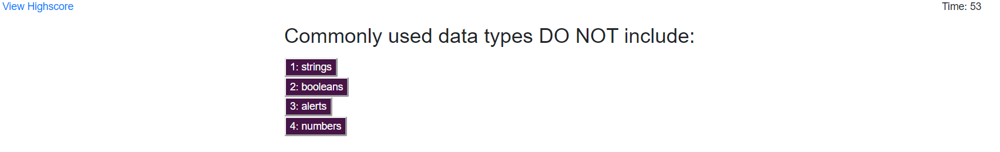

# CodeQuiz

The user will take a quiz that will ask questions about coding. A timer will start that will keep track of how long the quiz takes. If they get a question wrong then it will knock off ten seconds. Once the user finishes the quiz, they will enter their initials and it will take them to a "High Scores" page. They will be able to see their score and how it compares to other quiz-takers. They are then able to clear the high scores or retake the quiz. 

[Link to deployed quiz](https://lauraearmstrong1.github.io/CodeQuiz/index.html)

